# Customer journey UI/UX review

Date: 24 August 2026

## Outcome

The customer journey was reviewed and refined from account entry through Ticket tracking, image selection, image annotation, review, and Ticket detail. The final implementation keeps the existing permissions and submission behavior while improving clarity, touch targets, visual hierarchy, and responsive layout.

All screenshots below use local preview data. No account was created and no Ticket was submitted.

## Improvements made

- Replaced customer-facing internal terminology with consistent Ticket language.
- Clarified account selection with descriptive customer and staff paths.
- Simplified the three-step progress indicator on mobile while retaining richer status labels on desktop.
- Added useful examples, field counters, and clearer optional-field guidance.
- Rebuilt the image picker around three distinct actions: take a photo, choose files, and drag or paste files.
- Added visible file limits before selection and clearer validation messages.
- Improved image preview tiles, reorder guidance, removal controls, and 44px touch targets.
- Changed technical “pin” language to the more customer-friendly “note” language.
- Added “Skip for now” when customers choose not to attach files.
- Made the mobile image-annotation workspace full-screen to avoid stacked bottom sheets.
- Improved bottom-sheet spacing, sticky actions, and scroll behavior on mobile.
- Preserved desktop dialog sizing while increasing radius, contrast, and backdrop separation.

## Responsive QA matrix

| Area | Desktop | Mobile |
| --- | --- | --- |
| Account choice | [Screenshot](screenshots/01-auth-account-choice-desktop.png) | [Screenshot](screenshots/11-auth-account-choice-mobile.png) |
| Customer sign in | [Screenshot](screenshots/02-customer-sign-in-desktop.png) | [Screenshot](screenshots/12-customer-sign-in-mobile.png) |
| Customer sign up | [Screenshot](screenshots/03-customer-sign-up-desktop.png) | [Screenshot](screenshots/13-customer-sign-up-mobile.png) |
| Customer portal | [Screenshot](screenshots/04-customer-portal-desktop.png) | [Screenshot](screenshots/14-customer-portal-mobile.png) |
| New Ticket details | [Screenshot](screenshots/05-new-ticket-details-desktop.png) | [Screenshot](screenshots/15-new-ticket-details-mobile.png) |
| Add images — empty | [Screenshot](screenshots/06-add-images-empty-desktop.png) | [Screenshot](screenshots/16-add-images-empty-mobile.png) |
| Add images — selected | [Screenshot](screenshots/07-add-images-filled-desktop.png) | [Screenshot](screenshots/17-add-images-filled-mobile.png) |
| Image marker | [Screenshot](screenshots/08-image-marker-desktop.png) | [Screenshot](screenshots/18-image-marker-mobile.png) |
| Review Ticket | [Screenshot](screenshots/09-review-ticket-desktop.png) | [Screenshot](screenshots/19-review-ticket-mobile.png) |
| Ticket detail | [Screenshot](screenshots/10-ticket-detail-desktop.png) | [Screenshot](screenshots/20-ticket-detail-mobile.png) |

## Screenshots

### Account choice

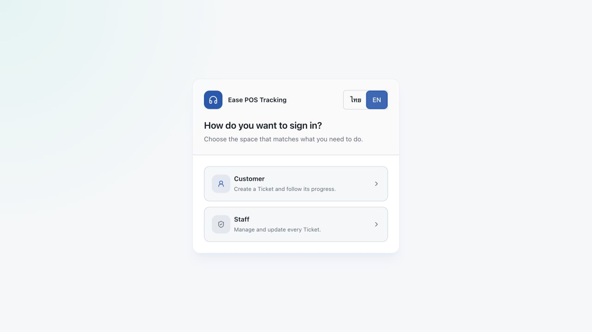

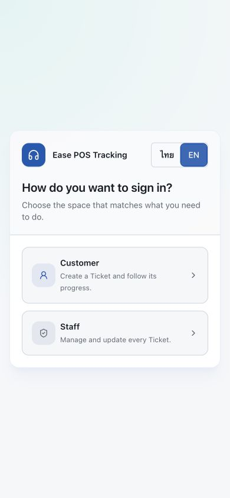

### Customer sign in

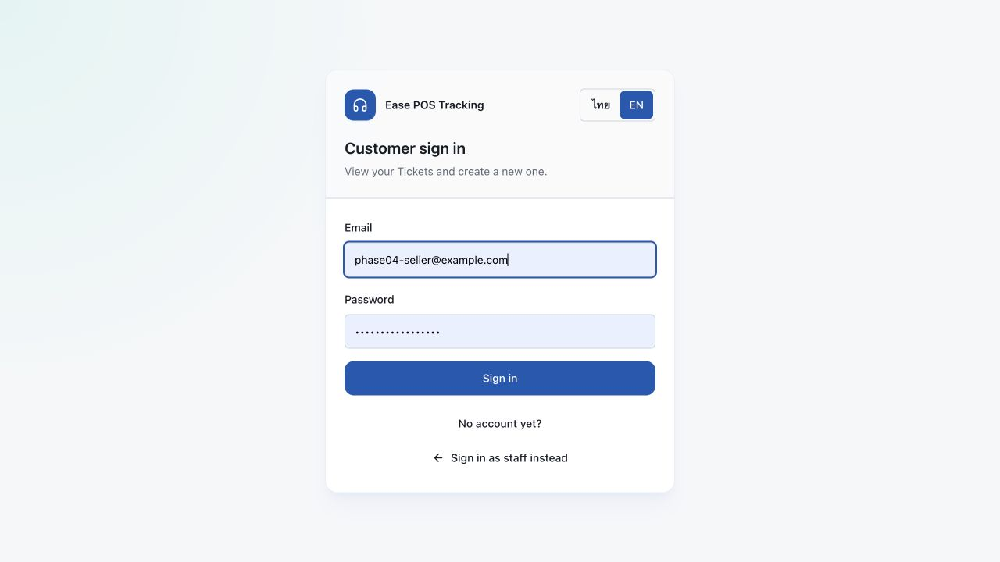

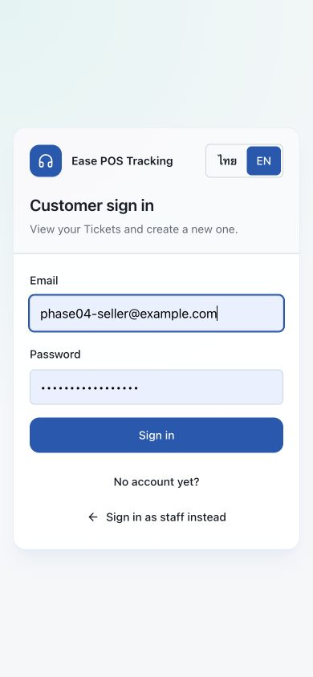

### Customer sign up

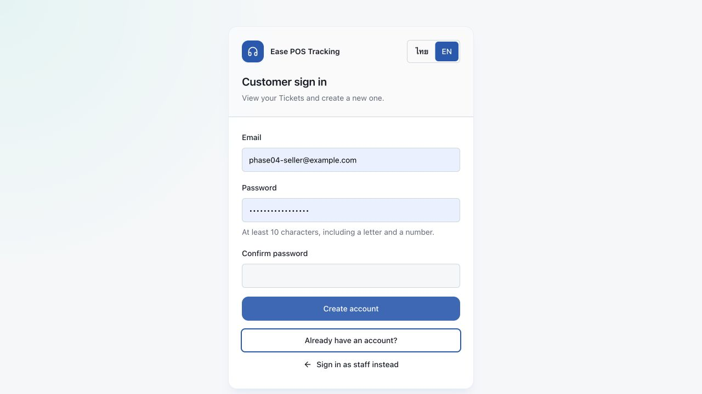

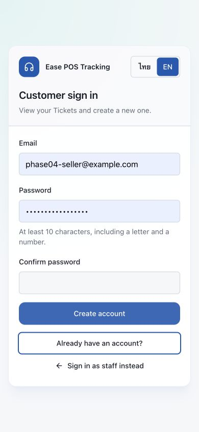

### Customer portal

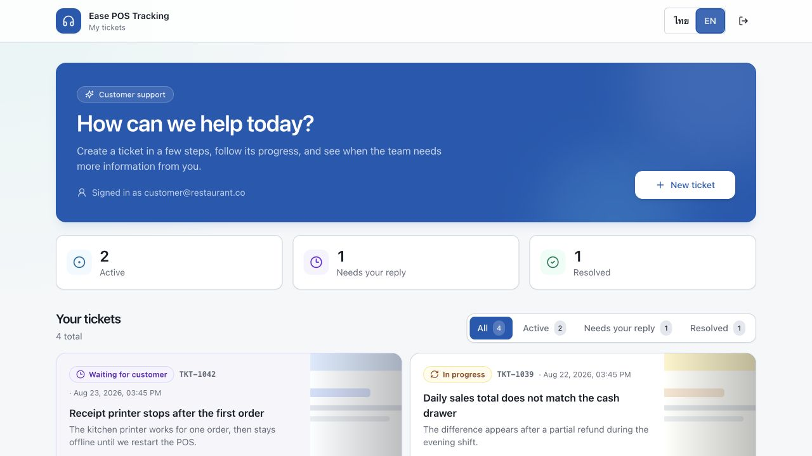

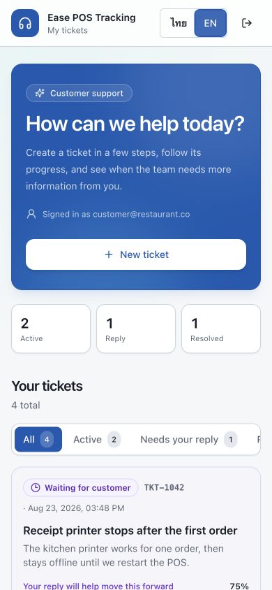

### New Ticket details

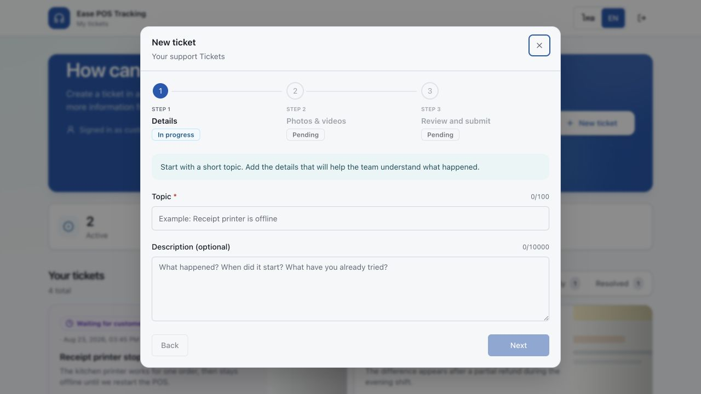

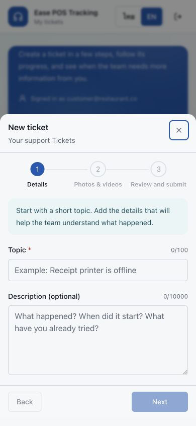

### Add images — empty state

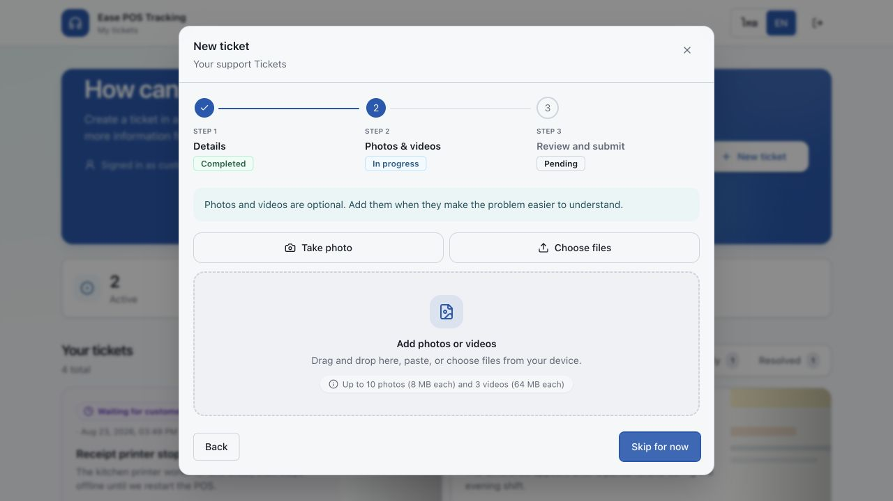

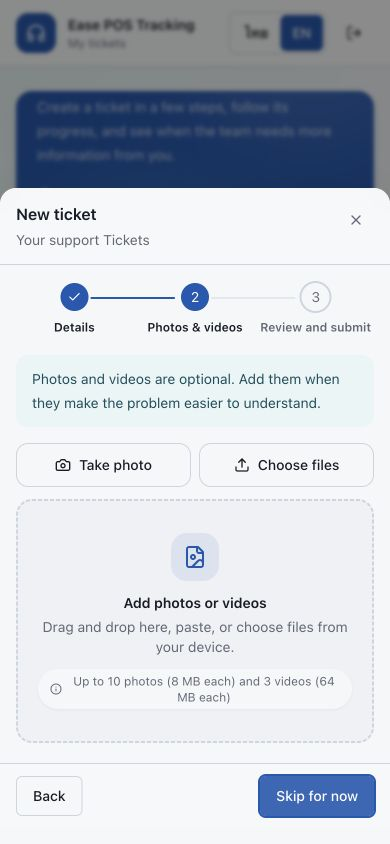

### Add images — selected state

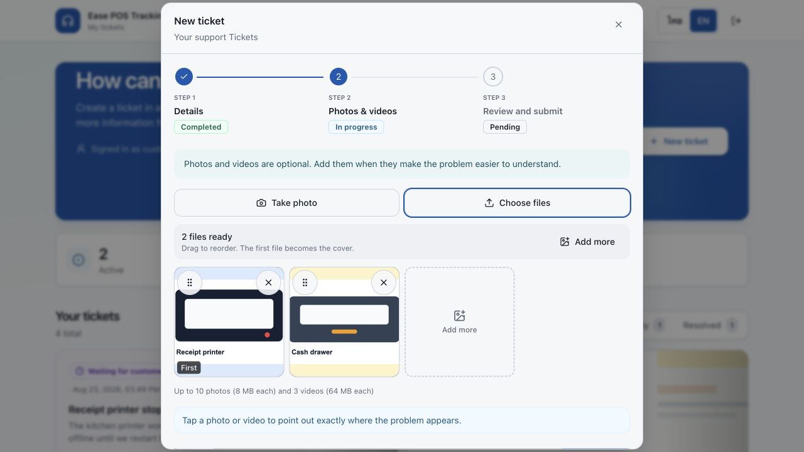

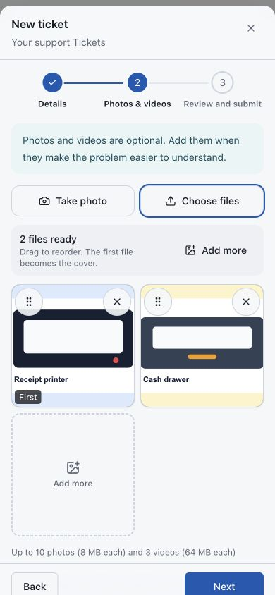

### Image marker

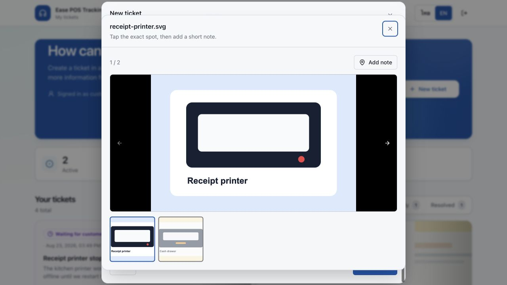

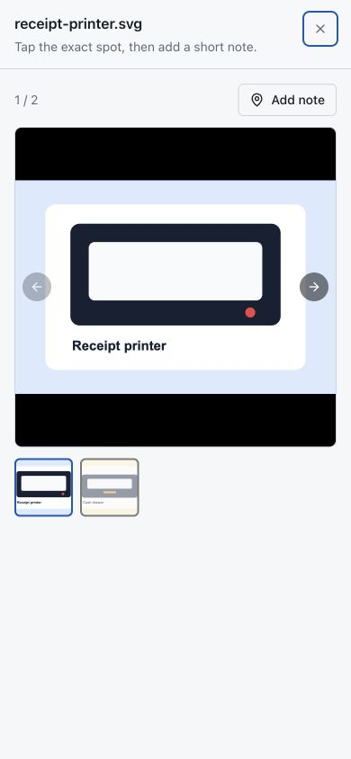

### Review Ticket

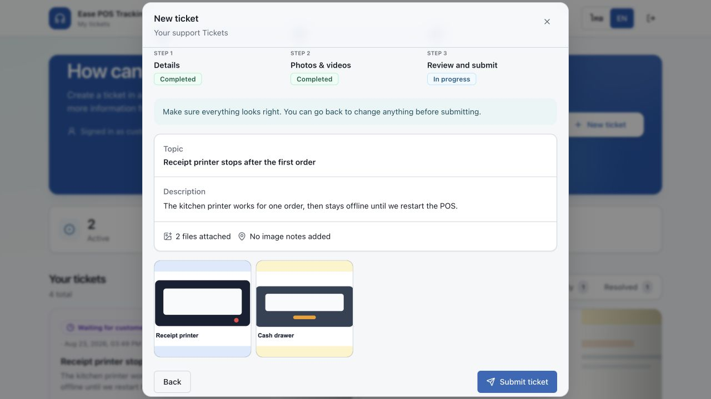

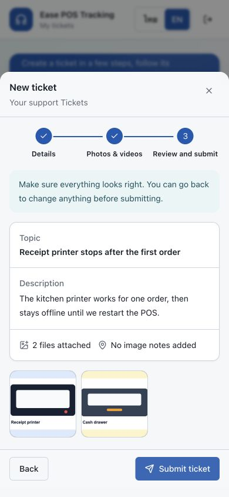

### Ticket detail

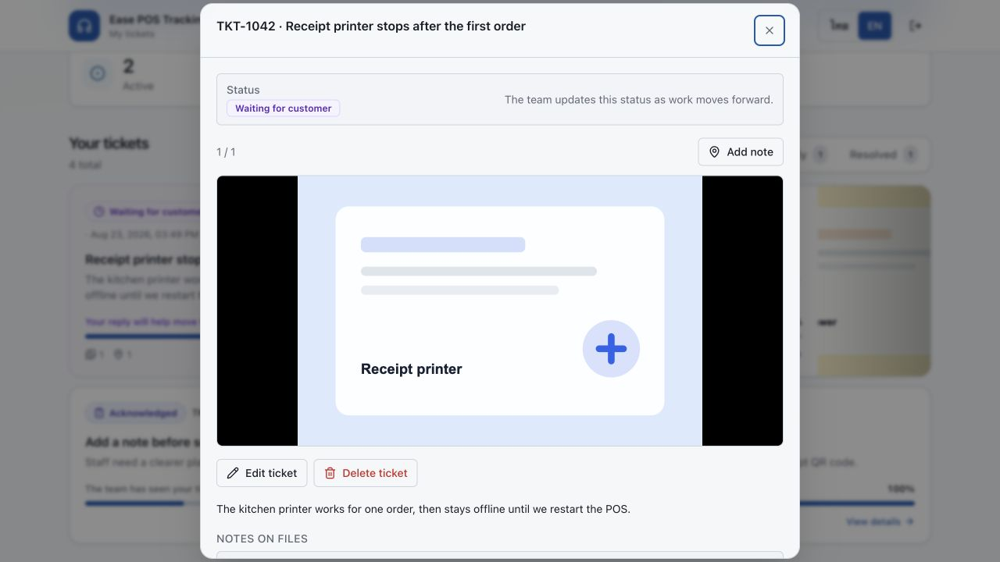

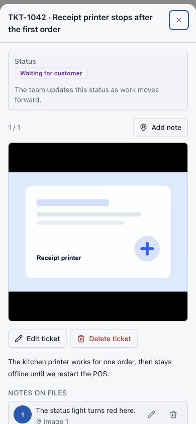

## Verification checklist

- Customer and staff account choices remain separate.
- Ticket details are required before later steps become available.
- Photos and videos remain optional.
- Camera, file picker, drag-and-drop, and paste entry points remain available.
- File limits and validation rules remain unchanged.
- Selected files can still be previewed, reordered, annotated, and removed.
- Review accurately summarizes text, files, and image notes.
- No submit action was triggered during visual QA.
- Desktop and 390 × 844 mobile layouts were checked in-browser.
